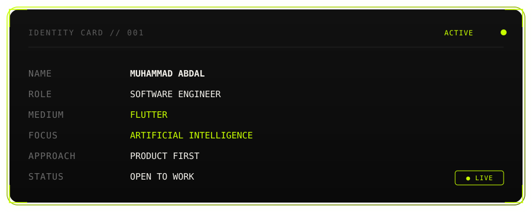
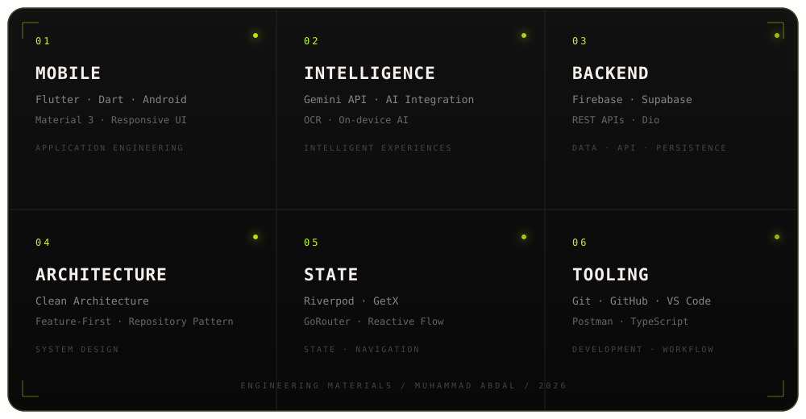
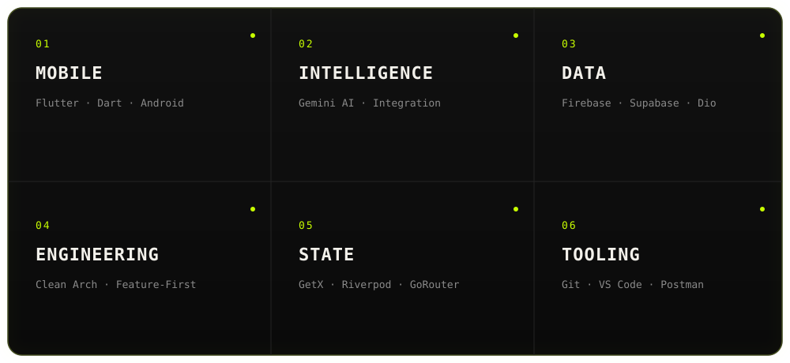
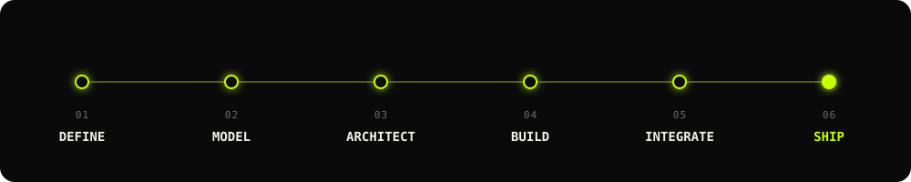
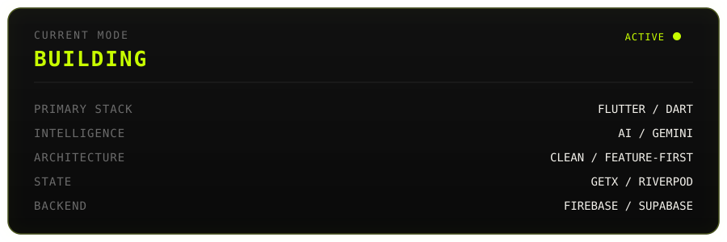

<code>001 / DIGITAL IDENTITY · 2026</code>

# MUHAMMAD ABDAL

### SOFTWARE ENGINEER

`FLUTTER` × `ARTIFICIAL INTELLIGENCE`

`MOBILE SYSTEMS`   `AI EXPERIENCES`   `PRODUCT ENGINEERING`

&nbsp;

&nbsp;

 

 

<!-- ========================================================= -->
<!-- 01 / IDENTITY -->
<!-- ========================================================= -->

<table>
<tr>

<td width="10%" valign="top">

01

</td>

<td width="90%">

<code>IDENTITY / ENGINEERING</code>

# I BUILD MOBILE SOFTWARE

# THAT FEELS HUMAN.

Flutter-focused software engineer building mobile applications with an emphasis on **clean architecture, maintainable systems, responsive interfaces, and practical AI integration.**

 

`STRUCTURE` · `PERFORMANCE` · `MAINTAINABILITY` · `CLARITY`

  

</td>

</tr>
</table>

 

---

 

<!-- ========================================================= -->
<!-- 02 / SKILL SYSTEM -->
<!-- ========================================================= -->

<table>
<tr>

<td width="10%" valign="top">

02

</td>

<td width="90%">

<code>SKILL SYSTEM / TECHNOLOGY</code>

# THE ENGINEERING STACK.

My current technical stack across **mobile development, application architecture, backend services, AI integration, and development tooling.**

 

</td>

</tr>
</table>

 

---

 

<!-- ========================================================= -->
<!-- 03 / MOBILE -->
<!-- ========================================================= -->

<table>
<tr>

<td width="10%" valign="top">

03

</td>

<td width="90%">

<code>MOBILE / APPLICATIONS</code>

# MOBILE ENGINEERING.

 

<table width="100%">

<tr>

<td width="50%" valign="top">

### FLUTTER

`DART`

`MATERIAL 3`

`RESPONSIVE UI`

`CUSTOM WIDGETS`

`ANDROID`

</td>

<td width="50%" valign="top">

### APPLICATION DEVELOPMENT

`API INTEGRATION`

`AUTHENTICATION`

`LOCAL STORAGE`

`IMAGE HANDLING`

`OFFLINE-FIRST PATTERNS`

</td>

</tr>

</table>

 

</td>

</tr>
</table>

 

---

 

<!-- ========================================================= -->
<!-- 04 / ARCHITECTURE -->
<!-- ========================================================= -->

<table>
<tr>

<td width="10%" valign="top">

04

</td>

<td width="90%">

<code>ARCHITECTURE / SYSTEMS</code>

# SYSTEMS THAT SCALE

# WITHOUT CHAOS.

 

<table width="100%">

<tr>

<td width="33%" valign="top">

### ARCHITECTURE

`CLEAN ARCHITECTURE`

`FEATURE-FIRST`

`REPOSITORY PATTERN`

`SEPARATION OF CONCERNS`

</td>

<td width="33%" valign="top">

### STATE

`RIVERPOD`

`GETX`

`REACTIVE STATE`

`DEPENDENCY INJECTION`

</td>

<td width="33%" valign="top">

### NAVIGATION

`GO_ROUTER`

`ROUTING`

`DEEP LINKS`

`SCREEN FLOWS`

</td>

</tr>

</table>

 

</td>

</tr>
</table>

 

---

 

<!-- ========================================================= -->
<!-- 05 / BACKEND -->
<!-- ========================================================= -->

<table>
<tr>

<td width="10%" valign="top">

05

</td>

<td width="90%">

<code>BACKEND / DATA</code>

# CONNECTED APPLICATIONS.

 

<table width="100%">

<tr>

<td width="50%" valign="top">

### BACKEND SERVICES

`FIREBASE`

`SUPABASE`

`AUTH`

`FIRESTORE`

`REALTIME DATABASE`

</td>

<td width="50%" valign="top">

### API & DATA

`REST APIs`

`DIO`

`JSON`

`SERIALIZATION`

`CLOUD DATA`

`LOCAL CACHE`

</td>

</tr>

</table>

 

</td>

</tr>
</table>

 

---

 

<!-- ========================================================= -->
<!-- 06 / AI -->
<!-- ========================================================= -->

<table>
<tr>

<td width="10%" valign="top">

06

</td>

<td width="90%">

<code>INTELLIGENCE / AI</code>

# AI-POWERED APPLICATIONS.

 

<table width="100%">

<tr>

<td width="33%" valign="top">

### AI INTEGRATION

`GEMINI API`

`PROMPT ENGINEERING`

`AI FEATURES`

`CONTEXT-AWARE FLOWS`

</td>

<td width="33%" valign="top">

### IMAGE & OCR

`OCR`

`IMAGE INPUT`

`TEXT EXTRACTION`

`DOCUMENT PROCESSING`

</td>

<td width="33%" valign="top">

### AI APPLICATIONS

`AI-ASSISTED FEATURES`

`MODEL INTEGRATION`

`AI WORKFLOWS`

`API-BASED AI`

</td>

</tr>

</table>

 

`AI` × `APPLICATION LOGIC` × `USER EXPERIENCE`

</td>

</tr>
</table>

 

---

 

<!-- ========================================================= -->
<!-- 07 / TOOLCHAIN -->
<!-- ========================================================= -->

<table>
<tr>

<td width="10%" valign="top">

07

</td>

<td width="90%">

<code>DEVELOPER TOOLCHAIN</code>

# FROM EDITOR

# TO BUILD.

 

<table width="100%">

<tr>

<td width="25%" valign="top">

### CODE

`DART`

`TYPESCRIPT`

`C++`

</td>

<td width="25%" valign="top">

### VERSIONING

`GIT`

`GITHUB`

`BRANCHING`

`VERSION CONTROL`

</td>

<td width="25%" valign="top">

### DEVELOPMENT

`VS CODE`

`ANDROID STUDIO`

`POSTMAN`

`REST CLIENTS`

</td>

<td width="25%" valign="top">

### ECOSYSTEM

`FLUTTER`

`FIREBASE`

`SUPABASE`

`NPM`

</td>

</tr>

</table>

 

`WRITE` → `DEBUG` → `TEST` → `BUILD` → `SHIP`

</td>

</tr>
</table>

 

---

 

<!-- ========================================================= -->
<!-- 08 / CAPABILITY -->
<!-- ========================================================= -->

<table>
<tr>

<td width="10%" valign="top">

08

</td>

<td width="90%">

<code>CAPABILITY MAP / 2026</code>

# WHAT I CAN BUILD.

I work across the layers required to turn an application idea into a structured mobile product.

 

 

<table width="100%">

<tr>

<td width="25%" valign="top">

### 01 / INTERFACE

`FLUTTER`

`DART`

`MATERIAL 3`

`RESPONSIVE UI`

</td>

<td width="25%" valign="top">

### 02 / APPLICATION

`STATE`

`ROUTING`

`ARCHITECTURE`

`BUSINESS LOGIC`

</td>

<td width="25%" valign="top">

### 03 / SERVICES

`FIREBASE`

`SUPABASE`

`REST API`

`DIO`

</td>

<td width="25%" valign="top">

### 04 / INTELLIGENCE

`GEMINI API`

`AI FEATURES`

`OCR`

`IMAGE INPUT`

</td>

</tr>

</table>

 

`IDEA` → `INTERFACE` → `LOGIC` → `DATA` → `INTELLIGENCE` → `PRODUCT`

</td>

</tr>
</table>

 

---

 

<!-- ========================================================= -->
<!-- 09 / PRINCIPLES -->
<!-- ========================================================= -->

<table>
<tr>

<td width="10%" valign="top">

09

</td>

<td width="90%">

<code>ENGINEERING PRINCIPLES</code>

# HOW I BUILD.

 

<table width="100%">

<tr>

<td width="16%" valign="top">

### 01

**PURPOSE**

Build for a real problem.

</td>

<td width="16%" valign="top">

### 02

**CLARITY**

Keep complexity understandable.

</td>

<td width="16%" valign="top">

### 03

**STRUCTURE**

Separate responsibilities.

</td>

<td width="16%" valign="top">

### 04

**PERFORMANCE**

Avoid unnecessary work.

</td>

<td width="16%" valign="top">

### 05

**MAINTAINABILITY**

Make the next change easier.

</td>

<td width="16%" valign="top">

### 06

**PRODUCT**

Engineering serves the experience.

</td>

</tr>

</table>

 

`PURPOSE` · `CLARITY` · `STRUCTURE` · `PERFORMANCE` · `MAINTAINABILITY`

</td>

</tr>
</table>

 

---

 

<!-- ========================================================= -->
<!-- 10 / CURRENT STATE -->
<!-- ========================================================= -->

<table>
<tr>

<td width="10%" valign="top">

10

</td>

<td width="90%">

<code>2026 / CURRENT STATE</code>

# BUILDING THE NEXT LAYER.

Currently expanding my engineering capabilities across:

 

<table width="100%">

<tr>

<td width="25%" valign="top">

### FLUTTER

Advanced application architecture, responsive interfaces, reusable components, and production-oriented mobile development.

</td>

<td width="25%" valign="top">

### AI

Building practical AI-powered application experiences through model APIs and intelligent application workflows.

</td>

<td width="25%" valign="top">

### BACKEND

Expanding backend capabilities across Firebase, Supabase, APIs, and TypeScript-based development.

</td>

<td width="25%" valign="top">

### PRODUCT

Turning technical capabilities into useful, maintainable, user-focused software.

</td>

</tr>

</table>

 

 

`LEARN` → `BUILD` → `SHIP` → `ITERATE`

</td>

</tr>
</table>

 

---

 

<!-- ========================================================= -->
<!-- 11 / CONTACT -->
<!-- ========================================================= -->

<code>11 / CONTACT</code>

# LET'S BUILD

# SOMETHING USEFUL.

 

&nbsp;

&nbsp;

  

 

`MUHAMMAD ABDAL` · `SOFTWARE ENGINEER` · `FLUTTER × AI` · `2026`

